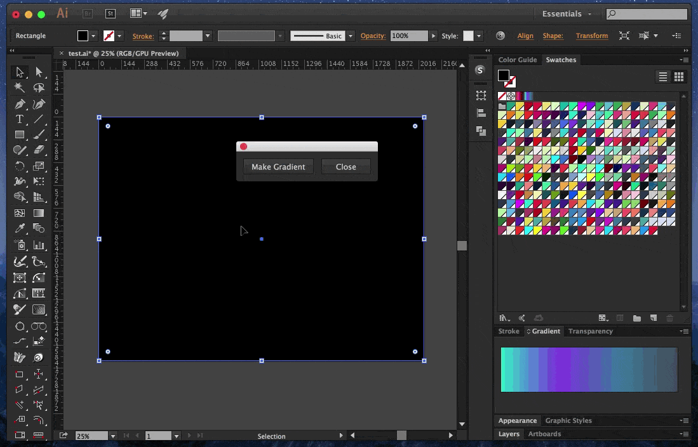
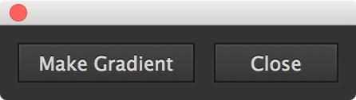

# Illy Grad

**Create gradient from selected swatches in Adobe Illustrator.**



## Installation

Use the below single-line Unix bash command to quickly install this script into your Illustrator `Scripts` folder.

```bash
bash <(curl -sL https://git.io/vrsJX)
```

Alternatively, you can dowload [`Gradient from Swatches.jsx`](Gradient from Swatches.jsx) into your Illustrator `Scripts` folder, located in the `/lllustrator CC/Presets` folder in your `lllustrator CC` installation directory.

The script’s filename, minus the file extension, will appear in the Scripts menu.

Run the script from the scripts menu in Illustrator.

Voilà!

## Usage



1. Open the script
1. Select swatches
1. Click “Make Gradient”

---

[](https://creativecommons.org/publicdomain/zero/1.0/)

To the extent possible under law, [@mhulse](https://github.com/mhulse) has waived all copyright and related or neighboring rights to this work.


